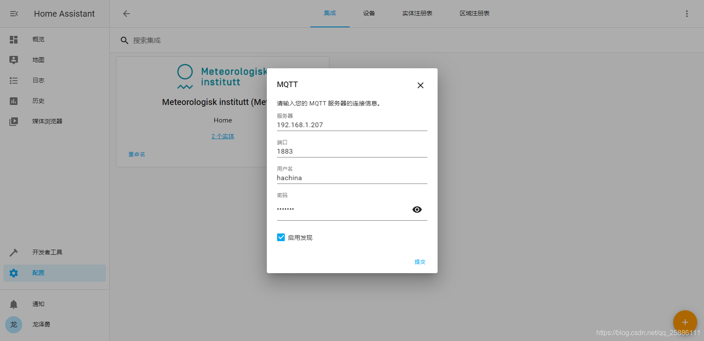

# ha-sensors-mqtt

[](https://opensource.org/licenses/MIT)

## 目的
简单便捷的linux服务器传感器数据连接到home assistant的中转工具。

## 开发进度
- [x] 支持sensors命令数据自动解析并上传
- [ ] 支持ssh至指定服务器获取数据
- [ ] 支持top命令数据自动解析并上传
- [ ] 支持hddtemp命令数据自动解析并上传
- [ ] 支持重启、关机等常用操作

## 优势
- 自动解析数据内容, 无需再home assistant中进行传感器配置
- 基于home assistant原生mqtt插件, 并提供应用dockerfile, 部署安装安装简易

## 使用方法

### 1、在对应服务器安装sensors
```
apt-get install lm-sensors
sensors-detect
sensors -j
```
这里以Ubuntu为例

### 2、部署mqtt服务
这里我们选择emqx为mqtt服务器, 通过docker进行部署
```
docker pull emqx/emqx
ocker run -dit --restart=always -d --name emqx -e EMQX_HOST="127.0.0.1" -e EMQX_NAME="emqx"  -p 4369:4369 -p 4370:4370 -p 5369:5369 -p 8083:8083 -p 8084:8084 -p 8883:8883 -p 0.0.0.0:1883:1883 -p 0.0.0.0:18083:18083 -p 0.0.0.0:9981:8081 emqx/emqx:latest
```

### 3、部署本应用
建议直接通过idea的docker插件部署

### 4、通过crontab设置定时数据上报
#### 4.1 新建上报脚本
```
sensors=$(sensors -j)
state="http://192.168.3.162:8080/mqtt/sensors/pve"
curl -H "Content-Type: application/json" -X POST -d "$sensors" $state
```
以Ubuntu为例, 192.168.3.162为本应用部署的ip和暴露的端口
#### 4.2 定时上报
开启定时任务配置文件
```
crontab -e
```
在第一行增加命令, 这里假设脚本路径为/home/sensors.sh, 每隔10s上报一次数据
```
* * * * * sleep 10; /home/sensors.sh >> /home/sensors.log
```

### 5、在home assistant中创建mqtt设备
#### 5.1 增加mqtt集成
配置-设备与服务-添加集成-mqtt
#### 5.2 配置mqtt集成

